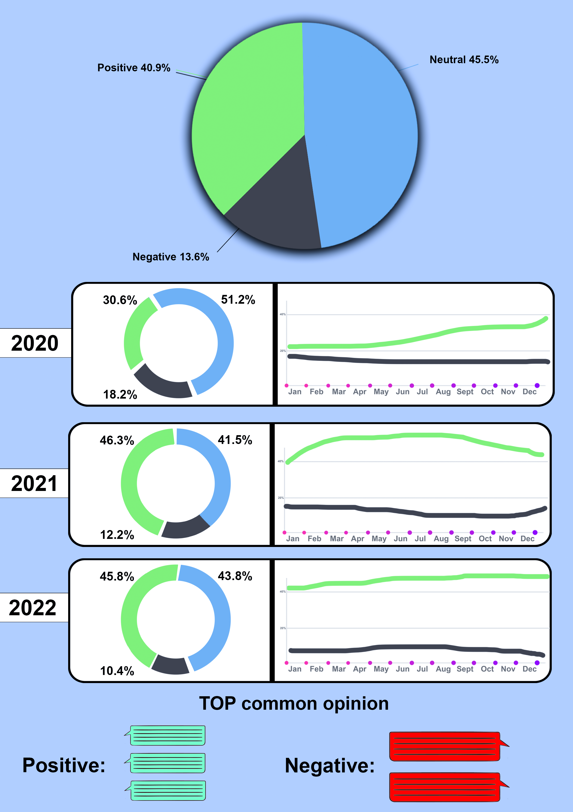
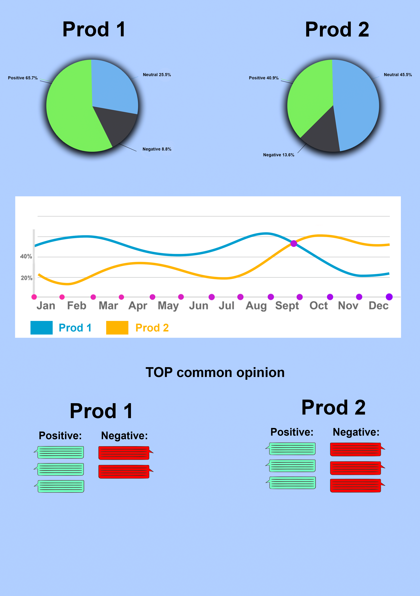
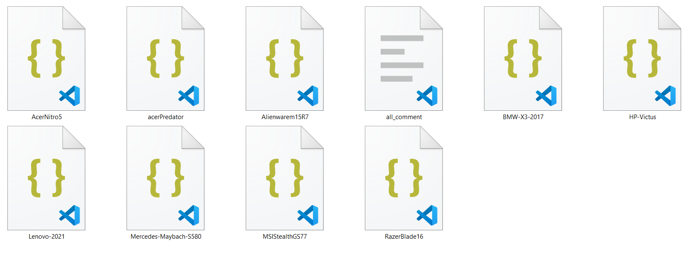
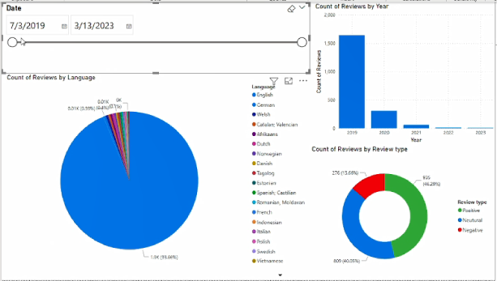
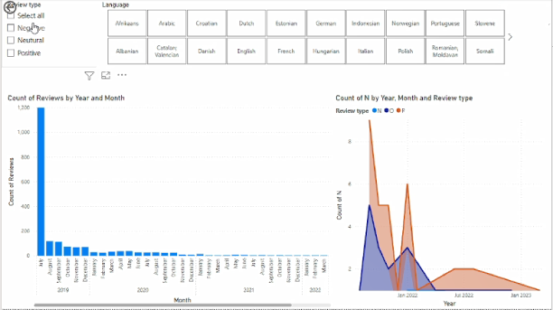
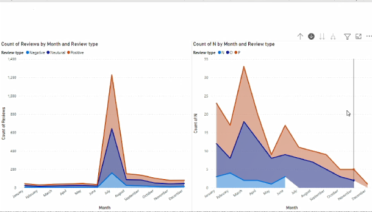

# script

##### my plan for hackathon is to develope platform to visualising and Predicting Business Trends then create model using random forest algorithm

**can see bussiness static each year**

**comporison between two Products to see from this chart we can see whitch product is the best seller**

---

### starting by scraping and analysing data from Youtube using Youtube API and TextBlob

|     | Variable    | Explanation                                                  |
| --: | :---------- | :----------------------------------------------------------- |
|   0 | title       | Number                                                       |
|   1 | Review      | Display text                                                 |
|   2 | Date        | The Date when the Review writen                              |
|   3 | Hour        | The Houre when the comment written                           |
|   4 | Review type | Comment Type P when it's Positive, N Negative, and O Neutral |
|   5 | Language    | The Languege of the comment                                  |

#### all_comment.ipynb :

is the file create dataset for the Website

business_list is an Array contain name of product or business and Youtube URL Link

---

analysing data using Power Bi

---
